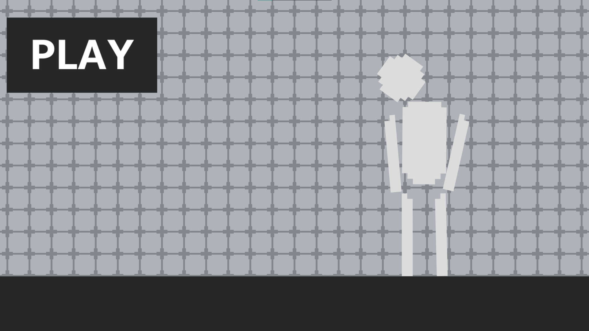
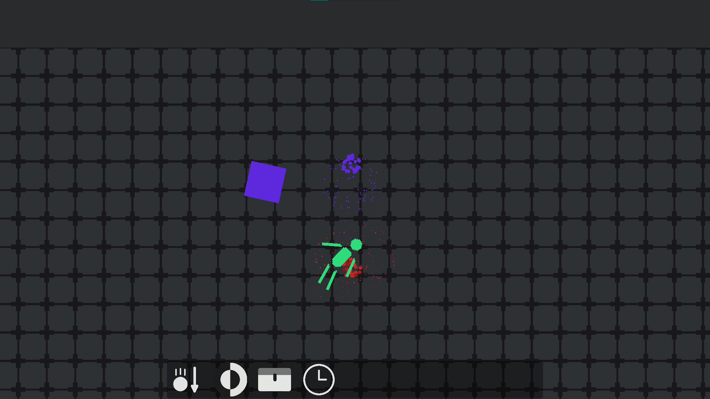
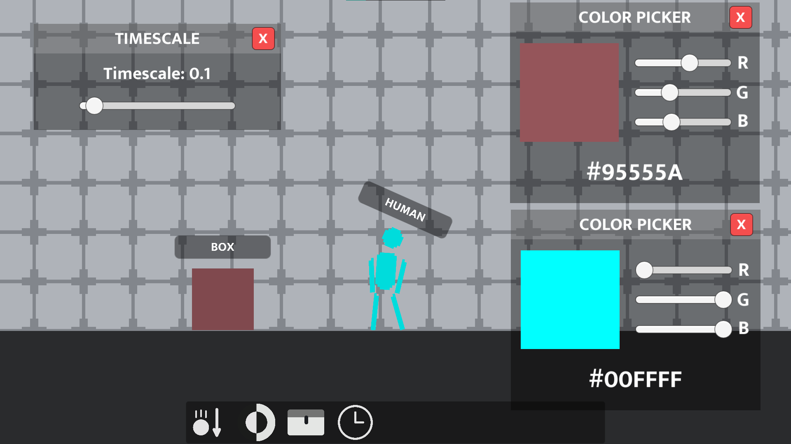

  <ul align="center" style="list-style: none;">
    

      <h1>Physics Lab</h1>
      
    

  </ul>

Physics Lab was a game that I had started working on some time in 2020-2021.

## Tech Stack
- Engine/Language: Unity (C#)
- Discord integration (no longer works due to removed Discord application)

## Features
- Spawn items (e)
- Enable/disable nametags (right click menu)
- Change object color (right click menu)
- View player health (right click menu)
- Change timescale (q)
- Move camera (middle click)
- Change gravity
- Switch between light/dark mode
- Throw and hit objects with particle effects and hit sounds

#### Known Issues
- The main menu buttons jump around upon clicking "Play". You have to quickly press on 'sandbox' to load the game. The other menu options are placeholders, they do not work.
- The game won't start without launching Discord (I had implemented Discord's Rich Presence feature, and I must've never implemented checks for whether the app was open)

  
   
  

Note: Some files may be missing, and the game might not load into Unity. This repository was only uploaded to display my personal growth, and will not be maintained.
